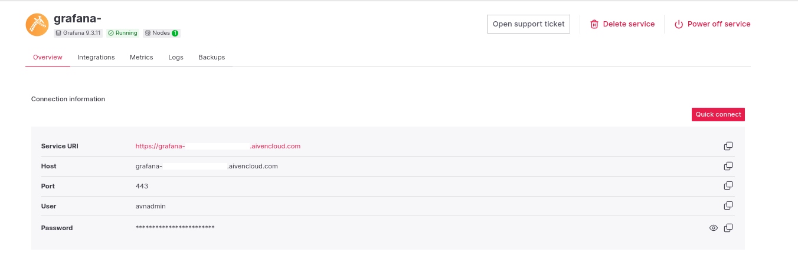

# Aiven Kafka Quickstart with Micronaut


## Introduction

Picture this: you are working for a new startup that aims to provide to every single
home a solution that will help to measure and optimize the energy consumption of devices.

Your project is ambitious, but there's no shortage of competitors. The key to your success lies in getting to market
quickly, with a resilient and distributed cloud infrastructure that will scale seamlessly as your customers adopt your
solution.

As your MVP (_Minimum-Value Product_), you need to develop a first feature that enables your customers to track their
daily energy consumption in real-time, measured in KW/h.

You're convinced that using both open-source solutions and cloud capabilities is the way to go for building your next
product. After a few hours of intensive workshops with your team, you end up with the following architecture:


But here's where the challenges begin. Neither you nor your teams have any previous experience in managing Apache Kafka
and other stream processing solutions. One thing's for sure: managing your data infrastructure is a headache you
don't want to have.

After a careful evaluation of the leading Saas vendors, your natural choice is **[Aiven](https://aiven.io/): an
all-in-one cloud data platform that provides Database and Streaming as a Service.**

Unfortunately, you're running out of time, and only have a few hours left to present your investors with a prototype
showing that you're capable of implementing such data infrastructure.

Does it seem impossible? Well, here's the good news. You've come to the right place! 😎

In the next sections, we will take a look at how to easily deploy and use the core components of this architecture
in a few minutes with Aiven.

For doing this, we are going to follow a step-by-step guide to set up the following solutions:

* [Aiven for Apache Kafka](https://aiven.io/kafka): Used to stream data measures from our customer devices.
* [Aiven for InfluxDB](https://aiven.io/influxdb): Used to store and query time series metrics our infrastructure.
* [Aiven for Grafana](https://aiven.io/grafana): Used to graph and observe our infrastructure metrics.

In addition, we will see how to implement, and configure a basic **Kafka Producer**
using [Micronaut](https://micronaut.io/).
Micronaut is a modern, JVM-based, framework for building lightweight and modular microservices and cloud-native
applications.

Finally, all that's left is to start our data streaming journey with Aiven 🚀. So, let's move on to the next section!

## 1. Getting Started

In this guide, we will :

- Create an Apache Kafka cluster on Aiven.
- Create a Micronaut application written in Java.
- Create an InfluxDB and Grafana service on Aiven.

## 2. What you will need?

To complete this guide, you will need the following:

* A text editor or IDE (e.g., [IntelliJ IDEA Community Edition](https://www.jetbrains.com/idea/download/#section=linux))
* JDK 17 installed and configured appropriately. The easiest way to install JAVA on Linux or Mac is
  to use [SDKMAN](https://sdkman.io/jdks).
* Your favorite Web browser to access the Aiven Web Console.
* And no credit card info needed! (Aiven offers $300 in free credits).

## 3. Setting Up Aiven for Apache Kafka (in 5min 🦀)

To get started with Apache Kafka, simply visit https://console.aiven.io/signup and create an account.

Once you've created your account, you will automatically be given **$300** worth of credits.

Next, create a new project and set up a new Apache Kafka service, choosing the **Cloud Provider** and **Region**
that you're used to using within your organization.

For this tutorial, you can select the `Startup-2` service plan. Also, don't forget to scroll down and
give your new Kafka service a cool name 😎.

_For more details instructions on how to set up an Apache Kafka service on Aiven, you can refer to the
documentation at https://docs.aiven.io/docs/products/kafka/getting-started._

When creating your Apache Kafka service, you will be prompted to choose your authentication method. Choose Client
certificate, and then, download the **CA Certificate**, **Access Certificate**, and **Access Key** to be able later to
authenticate to the Apache Kafka cluster.

Finally, use the downloaded certificates to create the client **Keystore** and **Truststore** using the following
commands:

```bash
# Create Client Keystore
openssl pkcs12 -export -inkey service.key -in service.cert -out client.keystore.p12 -name service_key
# Import Client Truststore
keytool -import -file ca.pem -alias CA -keystore client.truststore.jks
```

Read Aiven documentation for more
information: [Configure Java SSL keystore and truststore to access Apache Kafka](https://docs.aiven.io/docs/products/kafka/howto/keystore-truststore)

## 4. Initialize and build Micronaut project

Now that we have got a new Apache Kafka cluster, it's time to produce data for our use cases.

For doing this, we're going to write a simple Java application using Micronaut.

Usually, the best way to start coding with Micronaut is to generate and download a project
from: [Micronaut Launch](https://micronaut.io/launch).

Using the project generator, you will be asked to choose the type of your application and features to be added to your
project (e.g., `kafka`) :


Alternatively, you can generate the project using the Micronaut CLI.

```bash 
mn create-app --build=maven --jdk=17 \
--lang=java \ --test=junit \
--features=serialization-jackson,logback,management,kafka dev.iot.micronaut-device-energy-sender
```

_NOTE: Read the official document for installation details: https://docs.micronaut.io/latest/guide/#buildCLI._

However, for this tutorial, we will use a complete and working demo application example.

Let's clone the following GitHub repository:

```bash
git clone https://github.com/fhussonnois/aiven-kafka-micronaut-iot-demo.git
cd aiven-kafka-micronaut-iot-demo

# or
curl https://github.com/fhussonnois/aiven-kafka-micronaut-iot-demo/archive/refs/heads/main.zip 
```

To compile the project using Maven, run:

```bash
./mvnw clean verify 
```

## 5. Mock Data for Kafka

For our use case, we'll create fake data to simulate device energy consumption.

Each message (a.k.a. record) will be a _key/value_ pair representing a timestamped event containing the current
energy consumption of a customer's device. Both the record _Key_ and _Value_ will be serialized into JSON.

Because, an example is worth a thousand words, here, is a JSON _record_
that can be produced by our application:

_**Record Key:**_

```json
{
  "id": "09841b7-c94b-4148-892e-fa3937d43b9d"
}
```

_**Record Value:**_

```json
{
  "timestamp": "2023-06-10T18:33:33.869Z",
  "ownerId": "e09841b7-c94b-4148-892e-fa3937d43b9d",
  "ownerName": "Petter Parker",
  "deviceInfo": {
    "deviceId": "3c48529a-972f-4a02-aad5-addc1f3f17a9",
    "deviceName": "Coffee Maker"
  },
  "deviceSensors": {
    "watts": 974.06
  }
}
```

_**INFO:** Here, and in general with Apache Kafka, the use of a key will give us the guarantee that all events with the
same key
will be sent to the same topic-partition. This also enables us to guarantee the order in which messages will be
consumed._

The code snippet below shows how to create such an event, using the provided [Java classes](../micronaut-device-energy-sender/src/main/java/dev/iot/sender/data):

```java

public final class DeviceMeasureProvider {

    public DeviceMeasure getMeasure() {
        return DeviceMeasure.builder()
                .ownerId(UUID.randomUUID())
                .ownerName("Petter Parker")
                .deviceInfo(DeviceInfo.builder()
                        .deviceId(UUID.randomUUID())
                        .deviceName("Coffee Maker")
                        .build()
                )
                .deviceSensors(DeviceSensors.builder()
                        .watts(974.06)
                        .build()
                ).build();
    }
}
```

## 6. Writing the Kafka Producer

[Micronaut Kafka](https://micronaut-projects.github.io/micronaut-kafka/latest/guide/index.html) is able to create a
**Kafka Producer** simply by defining an interface that is annotated with `@KafkaClient.`

For example, the following is our `@KafkaClient` interface that will be used to send messages into Kafka topic.

```java

@KafkaClient(
        id = "${app.device.sender.kafka.client-id}",
        acks = KafkaClient.Acknowledge.ALL,
        properties = @Property(name = ProducerConfig.ENABLE_IDEMPOTENCE_CONFIG, value = "true")
)
public interface DeviceMeasureKafkaClient {

    @Topic("${app.device.sender.kafka.topic-source}")
    CompletableFuture<RecordMetadata> sendMeasure(@KafkaKey DeviceMeasureKey key, DeviceMeasure measure);
}
```

_Note: In the above code snippet, we defined a single method accepting two arguments: a `DeviceMeasureKey` and
a `DeviceMeasure,` corresponding respectively to the _key_ and _value_ of kafka record to be sent. The `@Topic`
annotation is used to indicate the topic to which record should be sent. Moreover, the topic name is externalized into 
the [`application.yml`](../micronaut-device-energy-sender/src/main/resources/application.yml) of the project._

_See: [DeviceMeasureKafkaClient](../micronaut-device-energy-sender/src/main/java/dev/iot/sender/service/DeviceMeasureKafkaClient.java)
source code._

The Micronaut Framework will automatically generate for use a class that implements the above client interface at built
time (using **ahead-of-time** (AOT) compiler). In addition, it's worth mentioning that, by default, objects are
serialized in JSON without any specific configuration.

Then all we need to do is inject our Kafka client into a _service_ class to send messages to Kafka.

For example, the following shows how to use _KafkaClient_ to send a message to Kafka every 5 seconds to simulate
energy consumption activity.

```java

@Singleton
public class DeviceMeasureSender {
    private final DeviceMeasureKafkaClient kafkaClient;
    private final DeviceMeasureProvider provider;

    // Constructor
    public DeviceMeasureSender(DeviceMeasureProvider provider, DeviceMeasureKafkaClient kafkaClient) {
        this.kafkaClient = kafkaClient;
    }

    @Scheduled(fixedDelay = "5s", initialDelay = "5s")  // @Scheduled: invoke this method every 5 seconds
    public void send() {
        // (1) Create device measure (i.e., kafka record value)
        var measure = provider.getMeasure();

        // (2) Create device measure key (i.e., kafka record key)
        var key = new DeviceMeasureKey(measure.ownerId());

        // (3) Send measure using the KafkaClient
        CompletableFuture<RecordMetadata> result = kafkaClient.sendMeasure(key, measure);
        // (4) Handle future... (code omitted for clarity)
    }
}
```

_See: [DeviceMeasureSender.java](../micronaut-device-energy-sender/src/main/java/dev/iot/sender/service/DeviceMeasureSender.java)
class for a more complete example._

Now that you have a better understanding of how to produce data in kafka with Micronaut, all we need to do is configure
and run our application.

## 7. Creating Kafka Topic

Before, running our application let's create a Kafka Topic:

1. Log into the [Aiven Web Console](https://console.aiven.io/) and select your Aiven for Apache Kafka service.
2. In the **Topics**, click the **`Add topic`** button.
3. Then, specify topic name `demo.iot.domestic-energy.device-measures.json`, as well as _Topic advances configuration_


## 8. Running the Application

_Micronaut Kafka_ gives you the possibility to configure a Kafka client using all the standard properties as described
in
the official [Apache Kafka documentation](https://kafka.apache.org/documentation/#producerconfigs), except that the
properties should be passed with the additional prefix: `kafka.`.

The easiest way to configure a Micronaut application is to use environment variables. By default, the Micronaut
Framework loads all OS environment variables and overrides any values defined in the `application.yml` file.

Create a `.env` file, which contains all the properties required to connect to Kafka, as follows:

```bash
cat > .env << EOF
KAFKA_BOOTSTRAP_SERVERS="<KAFKA_SERVICE_NAME>.aivencloud.com:26896"
KAFKA_SECURITY_PROTOCOL="SSL"
KAFKA_SSL_KEYSTORE_LOCATION="$(pwd)/client.keystore.p12"
KAFKA_SSL_KEYSTORE_PASSWORD="<PASSWORD>"
KAFKA_SSL_KEYSTORE_TYPE="PKCS12"
KAFKA_SSL_TRUSTSTORE_LOCATION="$(pwd)/client.truststore.jks"
KAFKA_SSL_TRUSTSTORE_PASSWORD="<PASSWORD>"
KAFKA_SSL_KEY_PASSWORD="<PASSWORD>"
EOF
```

To export all environment variables from the `.env` file, run:

```bash
source .env && export $(cut -d= -f1 < .env)
```

Next, to run the application, use the below command, which starts the application on port `8080`.

```bash
./mvnw -f ./micronaut-device-energy-sender/pom.xml mn:run
 ```

Finally, use `Ctrl-C` to stop the application.

## 9. Consuming Messages via Aiven Console

To see the messages produced above, let's go back the [Aiven Web Console](https://console.aiven.io/).

Then, navigate to the **Topic View** (_Services > Kafka > Topics -> Topic -> Fetch Messages_.)

From here, you should be able to retrieve messages in JSON format.


And Voilà! It's as simple as that.

## 10. Adding Observability and Monitoring

Now that we have a running Kafka Producer, it's time to build some observability capabilities to monitor our Apache
Kafka infrastructure.

For doing this, we will use the [Aiven Web Console](https://console.aiven.io/) to manage integration between all our
services.

### InfluxDB

First, we need to collect and send all the metrics of our Kafka services into InfluxDB, a time series database.
Follow those instructions to integrate your Kafka Service with InfluxDB :

1. Log into the [Aiven Web Console](https://console.aiven.io/) and select your Aiven for Apache Kafka service.
2. In the **Overview tab**, click the **`Manage Integrations`** button.
3. Then, select **Stores Metrics** under **Aiven solutions**.
   
4. Check _New service_, select _New InfluxDB service_ from the list, and click the **Continue** button.
   

Once, your InfluxDB is _Running_, it should start receiving metrics from your Kafka Service.

### Grafana

Next, we need to create a **Grafana Service**, and integrate it to the InfluxDB.

1. Go back to the _Services_ page and access to your newly created **InfluxDB Service**.
2. In the **Overview tab**, click the **`Manage Integrations`** button
3. Select **Grafana Metrics Dashboard** under **Aiven solutions**.
   
4. Check _New Service_ , select _New Grafana service_, and click on **Continue**

### Accessing Dashboard

Once, your Grafana Service is running, you can follow these steps to connect to Grafana:

1. Go back to the _Services_ page and access to your newly created **Grafana Service**.
2. In the **Overview tab**, copy or click on the _Service URI_ to launch the Grafana login page in a browser.
   
3. Using the sidebar menu, go to `Dashboards` > `Browse`.
4. In the **General tab**, open the `Aiven Kafka Dashboard` for your Kafka Service.

Congratulations! You should be able to visualize the metrics of your Kafka service.🎉


## What's Next?

In this article, we saw how simple it can be to start up a new Apache Kafka service using Aiven.

In addition, we used the Micronaut Framework to code a simple Java application to simulate data streaming activity.

Last but not least, we have leveraged Aiven solutions to build a complete observability infrastructure by
seamlessly integrating InfluxDB and Grafana with our Kafka service.

Finally, we've only scratched the surface of the implementation of the architecture defined in the introduction.
But here's the good news: all the solutions we introduced in our initial architecture diagram are available on Aiven.

I hope you've enjoyed this article and that it's given you some ideas on how Aiven can help you 
accelerate your Data infrastructure journey.

See you in a future post, to continue our data streaming journey with [Aiven](https://aiven.io/)!
